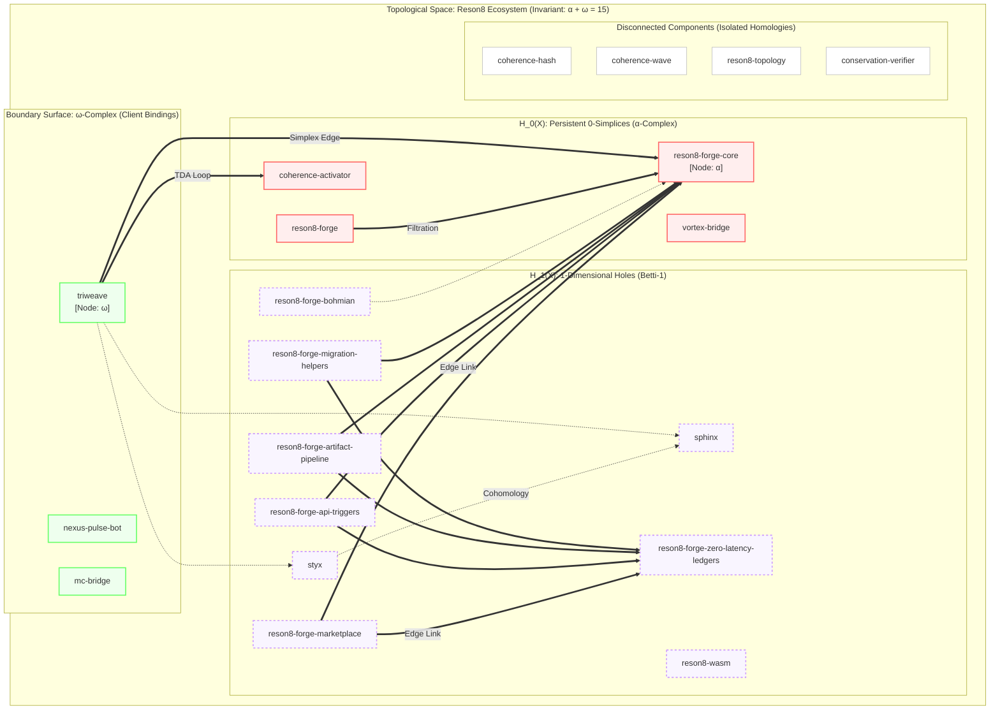

# Reson8 - Interactive System Architecture

Welcome to the interactive guide for the **Reson8** ecosystem. This document provides a top-down view of the Rust crates, workspace hierarchy, and frontend 2D projections via the MCP site templates.

## 1. System Dependency Graph

Below is the dependency flowchart mapping all internal components of the `reson8` workspace.



## 2. 2D Interactive Web Projections (MCP Templates)

The MCP repository provides the user interface layer, projecting backend functionalities onto 2D interactive webpages complete with live RSS, API hooks, and X integrations. 

### Priority UI Modules
These are the core control surfaces to interact with the system architecture:
- [OS](../coherence-mcp/coherence-site/public/os) - Primary Operating System interface overlay
- [Reforge](../coherence-mcp/coherence-site/public/reforge) - System forging layout
- [Terminal](../coherence-mcp/coherence-site/public/terminal) - Command-line visualization matrix
- [Inspector](../coherence-mcp/coherence-site/public/inspector) - Node/Crate inspection and deep-dive
- **Meta-Map** *(Currently integrated across system bounds)*

### Expanded Capabilities & Modifiers
- [Switchboard.html](../coherence-mcp/coherence-site/public/switchboard.html)
- [LINEAR-A-DECODED.html](../coherence-mcp/coherence-site/public/LINEAR-A-DECODED.html)
- [Forge TUI](../coherence-mcp/coherence-site/public/forge-tui)
- [Dashboard](../coherence-mcp/coherence-site/public/dashboard)
- [Canvas](../coherence-mcp/coherence-site/public/canvas)
- [Gate](../coherence-mcp/coherence-site/public/gate)
- [Portal](../coherence-mcp/coherence-site/public/portal)
- [Skills](../coherence-mcp/coherence-site/public/skills)
- [Publications](../coherence-mcp/coherence-site/public/publications)
- [Quantum PC](../coherence-mcp/coherence-site/public/quantum-pc)
- [Project MRI](../coherence-mcp/coherence-site/public/project-mri)
- [Market Portal](../coherence-mcp/coherence-site/public/market-portal)
- [ECG Monitor](../coherence-mcp/coherence-site/public/ecg-monitor)
- [Architectural Audit](../coherence-mcp/coherence-site/public/architectural-audit)
- [Guide](../coherence-mcp/coherence-site/public/guide)
- [Runtimes](../coherence-mcp/coherence-site/public/runtimes)
- [Topological Fuzzer](../coherence-mcp/coherence-site/public/topological-fuzzer)
- [Assets Directory](../coherence-mcp/coherence-site/public/assets)

---

## 3. Packaging & Deployment Instructions

### Verifying Compilation
The crates have been verified using `cargo check --workspace` after cleaning up `sccache` misconfigurations. 

> [!WARNING]
> The `conservation-verifier` crate (which utilizes `near-sdk`) failed to check under a native Windows target in some toolchain states. To successfully package the NEAR contracts, ensure you pass the specific wasm target:
> ```powershell
> # Build NEAR contracts specifically
> cargo build -p conservation-verifier --target wasm32-unknown-unknown --release
> ```

### A. Publishing to Crates.io
To package the libraries (like `reson8-forge` protocols):
```powershell
cargo publish -p reson8-forge
```
*Note: Ensure all `path` dependencies in `Cargo.toml` also have valid versions specified if pushing externally.*

### B. Building the Windows .exe Binaries
To build the end-user applications (like `triweave` and `nexus-pulse-bot`):
```powershell
# Produces optimized .exe files in target/release/
cargo build --release --bin triweave --bin nexus-pulse-bot
```

### C. PowerShell Gallery Packaging
If you plan to distribute `triweave` or the bots via PowerShell Gallery as a module:
1. Create a `.psd1` manifest file pointing to the compiled `.exe`.
2. Wrap the CLI outputs in PowerShell standard objects if desired.
3. Deploy:
```powershell
Publish-Module -Path ./ops/PSModule -NuGetApiKey <YOUR_KEY>
```
