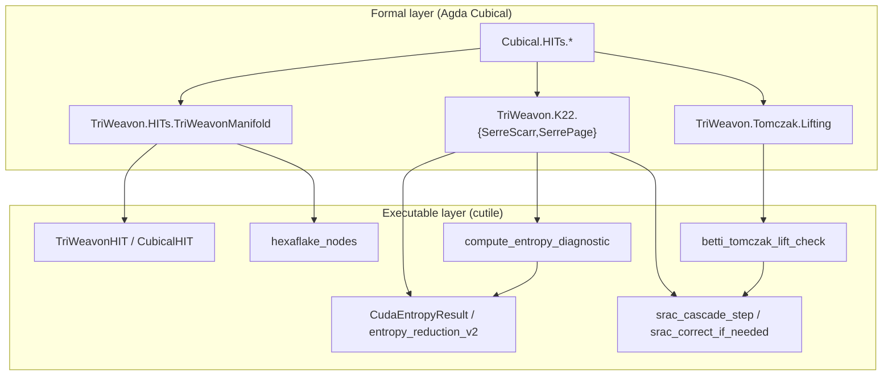

# Formal ↔ Executable Mapping — TriWeavon v0.3

Detailed correspondence between `agda/cubical` HIT primitives, TriWeavon Agda modules, and the `cutile` Rust/CUDA executable bridge.

**Agda project**: `F:\Users\Matthew Ruhnau\LogOS\agda`  
**Rust crate**: `F:\Users\Matthew Ruhnau\LogOS\cutiles\cutile`  
**Rendered cubical docs**: https://agda.github.io/cubical/Cubical.HITs.html

---

## Architecture



---

## 1. `Cubical.HITs` → TriWeavon → `cutile` (module index)

| `Cubical.HITs` module | Used in TriWeavon | Role | `cutile` counterpart |
|----------------------|-------------------|------|----------------------|
| [`Cubical.HITs.S²`](https://agda.github.io/cubical/Cubical.HITs.S2.html) | `TriWeavon.HITs.TriWeavonManifold` | Base 2-sphere (`base`, `surf`) for coarse/fine layers | `CubicalCell { dimension: 0 }` via `add_point` |
| [`Cubical.HITs.Susp`](https://agda.github.io/cubical/Cubical.HITs.Susp.html) | `TriWeavon.K22.SerreScarr` | `north`/`south`/`merid`; `hcomp` filler via `inS` | `tomczakLift` pattern → `hcomp_edge` |
| [`Cubical.HITs.Pushout`](https://agda.github.io/cubical/Cubical.HITs.Pushout.html) | `TriWeavon.K22.SerrePage` | `inl`/`inr`/`push` gluing of filtration cells | `sracPageStep` → `srac_cascade_step` depth index |
| [`Cubical.HITs.S¹`](https://agda.github.io/cubical/Cubical.HITs.S1.html) | `SerreScarPathInduction` (legacy) | Stage filtration paths | — (superseded by `SerreScarr`) |
| [`Cubical.Foundations.Prelude`](https://agda.github.io/cubical/Cubical.Foundations.Prelude.html) | all TriWeavon modules | `Path`, `hcomp`, `transport`, `compPath` | `CubicalHIT`, `HComp::fill` |
| — (custom HIT) | `TriWeavon.HITs.TriWeavonManifold` | `TwoScaleSphere`, `Hexaflake`, `glue`/`glueRec` | `TriWeavonHIT`, `hexaflake_nodes` |
| — (custom HIT) | `TriWeavon.K22.SerreScarr` | `SerreScarr`, `dᵣ`, `tomczakLift` | `CudaEntropyResult`, `betti_proxy` |
| — (record) | `TriWeavon.Tomczak.Lifting` | `TomczakLifting`, `LiftGate`, `liftOk` | `betti_tomczak_lift_check` |

---

## 2. Manifold HITs — `TriWeavon.HITs.TriWeavonManifold`

**Agda**: `agda/src/TriWeavon/HITs/TriWeavonManifold.agda`  
**Rust**: `cutile/src/hit/triweavon_hit.rs`, `cutile/src/hit/cubical.rs`, `cutile/src/core/hexaflake.rs`

### Constructor / operation mapping

| Agda construct | Cubical primitive | Executable semantics | `cutile` API |
|----------------|-------------------|----------------------|--------------|
| `S²` point `pt S²` | `Cubical.HITs.S².base` | 0-cell anchor | `TriWeavonHIT::add_point()` → `u64` id |
| `coarse x` / `fine x` | path over `S²` | two 0-cells in different layers | two `add_point()` calls; layer tag implicit in weave graph |
| `glue x : coarse x ≡ fine x` | 1-path constructor | oriented 1-cell between layers | `weave(coarse_id, fine_id)` |
| `mirrored` | path reversal on `glue` | involution on cell graph | not yet explicit — future `mirror_weave` |
| `Hexaflake.base` | 0-cell at level `n` | node in recursion tree | `hexaflake_nodes(r)` coordinate |
| `Hexaflake.recurse k` | 7-way branching (`Fin 7`) | 7 sub-tiles per level | `hexaflake_nodes` count grows ~7× per radius step |
| `Hexaflake.glueRec` | path between base and recurse | gluing 1-cell across scales | `weave` between parent/child node ids |
| `pathInductionAttractor` | `transport` along path | transport along edge | `hcomp_edge(a, b, t)` at `t ∈ [0,1]` |
| `E∞ = Σ n Hexaflake n` | sequential colimit | limit of all recursion levels | `hexaflake_nodes(r)` for finite truncation `r` |

### `TriWeavonHIT` cell model

```rust
// cutile/src/hit/triweavon_hit.rs
CubicalCell { dimension: 0, id }  // ↔ Agda 0-cell (point / gen)
CubicalCell { dimension: 1, id }  // ↔ Agda 1-path (glue / dᵣ / weave)
```

| Agda dimension | `CubicalCell.dimension` | Creation |
|----------------|-------------------------|----------|
| 0-cell | `0` | `add_point()` |
| 1-path / weave | `1` | `weave(a, b)` |

### `hcomp` face semantics

Agda `hcomp` in `tomczakLift` and `pathInductionAttractor` uses boundary faces `(i = i0)` and `(i = i1)`.

| Agda face | Interval endpoint | `cutile` behavior |
|-----------|-------------------|-------------------|
| `(i = i0) → gen n` | `t = 0` | `hcomp_edge(a, b, 0.0)` → `Some(a)` |
| `(i = i1) → p j` | `t = 1` | `hcomp_edge(a, b, 1.0)` → `Some(b)` |
| interior filler | `t ∈ (0,1)` | `hcomp_edge(a, b, t)` → `Some(weave(a,b))` |

`HComp::fill(t)` in `cubical.rs` provides scalar linear interpolation `face0 + t * (face1 - face0)` — the 1-dimensional cubical filler template.

### Hexaflake discretization

| Agda | Rust | Notes |
|------|------|-------|
| `Fin 7` recursion arms | 7-neighbor hex lattice | `hexaflake_nodes(radius)` returns `(q,s)` axial coords |
| `scale (1/3) x` | — | placeholder in Agda; Rust uses integer hex radius |
| `E∞` colimit | `hexaflake_nodes(r)` for finite `r` | executable truncates at chosen radius |

**Test anchor**: `integration.rs::hexaflake_grows_with_radius` ↔ `Hexaflake.recurse` increases node count.

---

## 3. Serre / K22 — `TriWeavon.K22.SerreScarr` + `SerrePage`

**Agda**: `agda/src/TriWeavon/K22/{SerreScarr,SerrePage}.agda`  
**Rust**: `cutile/src/core/{entropy,srac}.rs`, `cutile/src/backend/cuda.rs`  
**CUDA**: `cutile/kernels/blackwell_entropy_v2.cu`

### `SerreScarr` HIT ↔ spectral executables

| Agda | Type / kind | `cutile` / CUDA | Semantics |
|------|-------------|-----------------|-----------|
| `gen n` | 0-cell at degree `n` | mesh DOF index `idx` | generator at bidegree slot |
| `dᵣ n : gen n ≡ gen (n+r)` | 1-path (differential) | gradient channel `d_perp_rho_sq[point]` | differential raises degree by `r` |
| `dᵣ²-path n` | composed path | `compPath` coherence | `d_r ∘ d_r` proxy; check `dᵣ-coherence` |
| `tomczakLift p` | `hcomp` + `inS` (Susp) | `hcomp_edge` + surge gate | lifts unstable differential to filler cell |
| `dᵣ-coherence` | path algebra proof | `srac_correct_if_needed` | triggers correction when coherence fails |

### `Cubical.HITs.Susp` used by `tomczakLift`

```agda
-- TriWeavon.K22.SerreScarr
tomczakLift p = hcomp (λ j → λ { (i = i0) → gen n ; (i = i1) → p j }) (inS (gen (n + r)))
```

| Susp constructor | Agda | `cutile` |
|------------------|------|----------|
| `north` | suspension apex | `hcomp_edge` at `t=0` boundary |
| `south` | suspension base | `hcomp_edge` at `t=1` boundary |
| `merid a` | meridian path | `weave` between generators |
| `inS` | inclusion into Susp | `TriWeavonHIT::weave` creates 1-cell |

### `SerrePage` ↔ SRAC cascade

| Agda | `cutile` | Semantics |
|------|----------|-----------|
| `PageCell.r` | `filtration_depth` in `srac_cascade_step` | Serre page index `r` |
| `PageCell.p` | bidegree `p` (stored, not yet in Rust) | homological degree |
| `Differential.witness` | `dᵣ` path existence | differential as path data |
| `pathInductionPage` | `transport` along page cell | page-local transport |
| `sracPageStep` | `srac_cascade_step(current, depth, tau)` | advances page `r ↦ suc r` |

```rust
// cutile/src/core/srac.rs
srac_cascade_step(current, filtration_depth, tau)
// current + (φ+1 - current) * (1 - exp(-tau * depth))
```

### Entropy / surge / Betti pipeline

| Formal symbol | Agda module | Rust | CUDA output |
|---------------|-------------|------|-------------|
| `W[ω̃]` | — (Lean/physics layer) | `compute_entropy_diagnostic` → `w` | `out_w` |
| viscosity term | — | `compute_entropy_diagnostic` → `visc` | `out_visc` (= `-nu * Σ grad²`) |
| stretch term | — | `compute_entropy_diagnostic` → `stretch` | `out_stretch` (= `-tau * Σ strain*ω`) |
| Betti proxy | `SerreScarr` generator count | `betti_proxy(grad, threshold)` | `out_betti_proxy` (count `grad > threshold`) |
| Betti surge | `dᵣ` composition instability | `CudaEntropyResult::surge` | `out_surge` (relative `W` jump) |
| Surge detect | — | `DefaultSurgeDetector::detect_surge` | same formula as kernel |

**Formula alignment**:

```
betti_proxy  = |{ i : d_perp_rho_sq[i] > threshold }|
surge        = |W - prev_w_avg| / max(|prev_w_avg|, 1e-12) > surge_threshold
liftOk       = betti_proxy < lifting_threshold ∧ tomczak_preserved
```

**Test anchors**:
- `betti_proxy_counts_hot_gradients` ↔ `liftOk` first conjunct
- `srac_and_surge_pipeline` ↔ `srac_correct_if_needed(surge, !lift_ok, depth)`

### `Cubical.HITs.Pushout` in `SerrePage`

Pushout glues two spaces along a shared subspace:

```agda
data Pushout f g where
  inl : B → Pushout f g
  inr : C → Pushout f g
  push : (a : A) → inl (f a) ≡ inr (g a)
```

| Pushout ctor | `SerrePage` usage | `cutile` (planned) |
|--------------|-------------------|---------------------|
| `inl` | left page cell | page `(r, p)` left inclusion |
| `inr` | right page cell | page `(r, p')` right inclusion |
| `push` | `Differential.witness` | `weave(inl_id, inr_id)` — **not yet implemented** |

---

## 4. Tomczak lifting — `TriWeavon.Tomczak.Lifting`

**Agda**: `agda/src/TriWeavon/Tomczak/Lifting.agda`  
**Rust**: `cutile/src/core/srac.rs`

| Agda | Type | `cutile` | Notes |
|------|------|----------|-------|
| `TomczakLifting.preserved` | `X → Type` | — | type-level; not executable |
| `TomczakLifting.stable` | `isProp (preserved x)` | `tomczak_preserved: bool` | collapse to runtime flag |
| `TomczakLifting.lift` | `(x : X) → preserved x → X` | — | proof-relevant lift |
| `LiftGate.bettiProxy` | `Float` | `betti_proxy: f64` | gradient hot-spot count |
| `LiftGate.liftingThreshold` | `Float` | `lifting_threshold: f64` | stability cutoff |
| `LiftGate.tomczakPreserved` | `Bool` | `tomczak_preserved: bool` | structure preserved flag |
| `liftOk g` | `Bool` | `betti_tomczak_lift_check(...)` | exact match |

```agda
liftOk g = (bettiProxy g) < (liftingThreshold g) ∧ (tomczakPreserved g)
```

```rust
pub fn betti_tomczak_lift_check(betti_proxy: f64, lifting_threshold: f64, tomczak_preserved: bool) -> bool {
    betti_proxy < lifting_threshold && tomczak_preserved
}
```

| Agda | `cutile` |
|------|----------|
| `hcompFiller _ p = p` | `HComp::fill` / `hcomp_edge` identity at boundaries |

**SRAC gate**: when `surge_detected && !betti_lift_ok`, `srac_correct_if_needed` returns `SRACorrection` with `suggested_depth = depth - 1`.

---

## 5. `CubicalHIT` trait — full API correspondence

| Trait method | Agda analogue | `TriWeavonHIT` behavior |
|--------------|---------------|-------------------------|
| `add_point(&mut self) -> u64` | 0-cell introduction (`base`, `gen n`) | append `CubicalCell { dim: 0, id }` |
| `weave(&mut self, a, b) -> u64` | path constructor (`glue`, `dᵣ`, `merid`) | append `CubicalCell { dim: 1 }`, index `(a,b)` |
| `hcomp_edge(&mut self, a, b, t) -> Option<u64>` | `hcomp` with faces `i0`/`i1` | boundary collapse or interior `weave` |
| `point_count(&self) -> usize` | cell enumeration | `points.len()` (0- and 1-cells) |

---

## 6. End-to-end execution flow

```
1. Discretize manifold
   Agda: Hexaflake n  →  cutile: hexaflake_nodes(r)

2. Build cell graph
   Agda: glue / glueRec  →  cutile: add_point + weave

3. Run entropy pass (page r)
   Agda: SerreScarr X r  →  cutile: compute_entropy_diagnostic / CudaBackend

4. Measure Betti + surge
   Agda: dᵣ, dᵣ²-path  →  cutile: betti_proxy, CudaEntropyResult.surge

5. Tomczak gate
   Agda: liftOk  →  cutile: betti_tomczak_lift_check

6. SRAC correction (if needed)
   Agda: sracPageStep  →  cutile: srac_correct_if_needed → srac_cascade_step
```

### Reference Rust pipeline (from `integration.rs`)

```rust
let grad = /* d_perp_rho_sq */;
let betti = betti_proxy(&grad, threshold);
let lift_ok = betti_tomczak_lift_check(betti as f64, 1.0, true);
let surge = detector.detect_surge(current_w, prev_w_avg, 0.5);
let correction = srac_correct_if_needed(surge, !lift_ok, filtration_depth);
```

---

## 7. Test ↔ proof obligation map

| `cutile` test | Agda obligation | Status |
|---------------|-----------------|--------|
| `triweavon_hit_weave_points` | `weave` produces 1-cell between 0-cells | executable ✓ |
| `hcomp_edge_interpolates_weave` | `hcomp` boundary faces | executable ✓ |
| `hexaflake_grows_with_radius` | `recurse : Fin 7` increases cardinality | executable ✓ |
| `betti_proxy_counts_hot_gradients` | `liftOk` numerical conjunct | executable ✓ |
| `entropy_diagnostic_finite` | `W[ω̃]` finite on finite mesh | executable ✓ |
| `srac_and_surge_pipeline` | `srac_correct_if_needed` when `¬liftOk ∧ surge` | executable ✓ |
| — | `dᵣ-coherence` proof | Agda `refl` (proof ✓, not runtime) |
| — | `pathInductionAttractor` full J-rule | Agda skeleton only |

---

## 8. HTML documentation cross-links

Generate TriWeavon HTML:

```powershell
cd F:\Users\Matthew Ruhnau\LogOS\agda
pwsh -File scripts/html.ps1
# → docs/generated/TriWeavon.HITs.TriWeavonManifold.html
```

| Module | Local HTML (after render) | cubical reference |
|--------|-------------------------|-------------------|
| `TriWeavon.HITs.TriWeavonManifold` | `docs/generated/TriWeavon.HITs.TriWeavonManifold.html` | [Cubical.HITs.S²](https://agda.github.io/cubical/Cubical.HITs.S2.html) |
| `TriWeavon.K22.SerreScarr` | `docs/generated/TriWeavon.K22.SerreScarr.html` | [Cubical.HITs.Susp](https://agda.github.io/cubical/Cubical.HITs.Susp.html) |
| `TriWeavon.K22.SerrePage` | `docs/generated/TriWeavon.K22.SerrePage.html` | [Cubical.HITs.Pushout](https://agda.github.io/cubical/Cubical.HITs.Pushout.html) |
| `TriWeavon.Tomczak.Lifting` | `docs/generated/TriWeavon.Tomczak.Lifting.html` | [Cubical.Foundations.Prelude](https://agda.github.io/cubical/Cubical.Foundations.Prelude.html) |

---

## 9. Known gaps (option 4 backlog)

| Gap | Agda side | Rust side | Priority |
|-----|-----------|-----------|----------|
| `mirrored` involution | `TriWeavonManifold.mirrored` | no `mirror_weave` | medium |
| `Pushout.push` | `SerrePage.Differential` | no pushout weave | high |
| `PageCell.p` | bidegree field | not in `CudaEntropyResult` | low |
| `TomczakLifting.lift` | proof-relevant | only `bool` preserved flag | medium |
| `scale (1/3)` | rational scaling | integer hex radius only | low |
| GPU path | — | PTX not built (`used_gpu_kernel: false`) | high |

---

## 10. Build commands

### Agda

```powershell
cd F:\Users\Matthew Ruhnau\LogOS\agda
pwsh -File scripts/vendor.ps1
pwsh -File scripts/check.ps1
pwsh -File scripts/html.ps1
```

### cutile

```powershell
cd F:\Users\Matthew Ruhnau\LogOS\cutiles\cutile
cargo test -p cutile
pwsh -File scripts/build_ptx.ps1   # requires nvcc
cargo build -p cutile --features cuda
```

Without PTX, `CudaBackend` CPU-falls back (`used_gpu_kernel: false`).

---

## 11. Version lock

| Component | Version / path |
|-----------|----------------|
| `cutile` crate | `0.3.0` (`cutile::VERSION`) |
| Agda bridge tag | `TriWeavon.Core.cutileVersion` = `"0.3.0"` |
| `agda/cubical` | `agda/vendor/agda-cubical` (pinned at clone time) |
| Project lib | `agda/TriWeavon.agda-lib` |