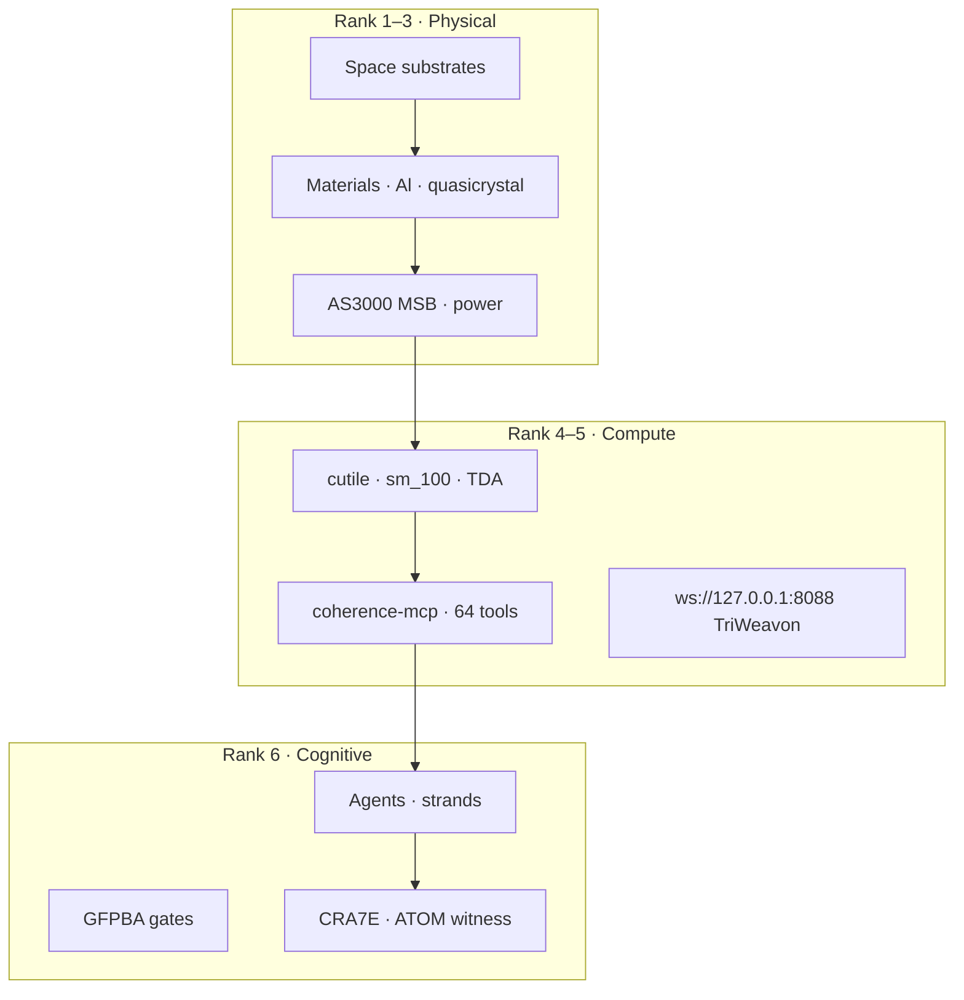
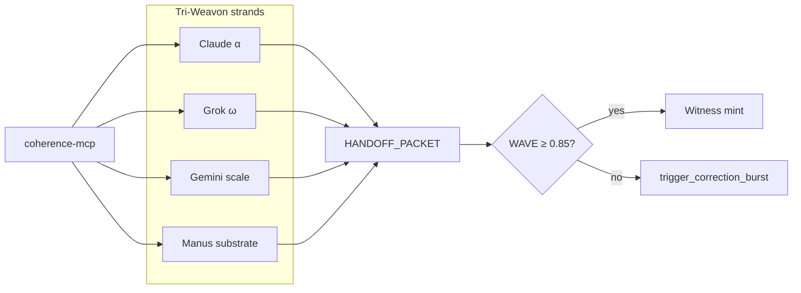

# Reson8-Labs · LogOS · Master Print Resource

**Version:** 1.0.0 · **Date:** 2026-06-29  
**Author:** Matthew Stephen Ruhnau · **Signature:** ~ Hope&&Sauced ✦ The Keystone Holds ✦  
**Purpose:** End-to-end printable technical and background resource — review, complete sections, topological views.

---

## How to use this document

1. **Print** → PDF via browser or `pandoc docs/RESON8-MASTER-PRINT-RESOURCE.md -o Reson8-Master.pdf`
2. **Complete** → Fill `[ ]` checkboxes and `_TBD_` fields as you ship each corridor
3. **Telemetry** → Append moves to `notebooks/AUKUS_Chessboard.ipynb` after each working session
4. **Negative space** → Section 12 is the living map of gaps only you occupy

**Living twin:** `notebooks/AUKUS_Chessboard.ipynb` (moves + conversation insights)

---

## 1. MeaningSeed (compressed invariant core)

| Invariant | Value | Role |
|-----------|-------|------|
| α + ω | 15 | Universal conservation — structural + semantic load |
| ε | 0.00055 | Minimum resolvable branch separation |
| 42.00055 | metastable attractor | Coherence hierarchy / music conservation |
| WAVE | ≥ 0.85 (85%) | Production gate for handoff |
| K22 sheaf | 22 vertices · 41 edges | Cellular complex for Serre-Scarr pages |
| GFPBA | diagnose → gate → ship | Generative Fixed Point Business Architecture |

**Strategic pivot (2026-06):** Formal proof pipelines (Serre-Scarr, Agda, Lean) reached **coherent closure** on X. Next phase: **experiment constructs** surface hidden patterns in daily activity → find **negative space** no one else occupies.

---

## 2. Topological overview

---

## 3. Entity map

| Entity | Role | Jurisdiction |
|--------|------|--------------|
| **Reson8-Labs Pty Ltd** | GFPBA holdco · consultancy · IP | Australia |
| **Anyon.E Enterprise** | AUKUS-facing deploy brand | AU / US / UK |
| **The Nek ANZAC Cooperative** | Public / educational face | CCU model |
| **CRA7E.nft** | On-chain witness registry | NEAR |
| **coherence-mcp** | MCP server · npm `@toolated/coherence-mcp@0.3.3` | MIT |
| **LogOS** | Rust/Python/Agda workspace | LogOS repo |

---

## 4. IP inventory (achievements & status)

| Artifact | Path / URL | Status | Notes |
|----------|------------|--------|-------|
| coherence-mcp v0.3.3 | `coherence-mcp/` · 64 MCP tools | **Shipped** | 8 bedrock + WAVE + vortex + integrations |
| MCP tool catalog | `coherence-mcp/docs/MCP_TOOL_CATALOG.md` | **Shipped** | Tier map · June 2026 |
| coherence.site articles | `coherence.toolated.online` | **Deployed** | 4-part Inter-Weaving Coherence series |
| AdHealth MeaningSeed | `adhealth-meaningseed/` | **Scaffold** | CTQW fatigue · contest submission pending |
| TriWeavon SelfBoot v2.2.2 | Downloads / layer5_unikernel | **Scaffold** | MirageOS · K22 intent embedded |
| BARCODE-TUI fixed point | `BARCODE-TUI-FIXED-POINT.md` | **Spec** | H0 PH · Ratatui · reson8-core |
| CASCADE-PLAN | `CASCADE-PLAN.md` | **Spec** | forge-cockpit · void-ring · hopf-weave |
| internal-handoff skill | `skills/internal-handoff/` | **Shipped** | Opus ↔ smaller model protocol |
| phasonic-flipper skill | `coherence-mcp/coherence-site/.../phasonic-flipper/` | **Shipped** | Hopf fibration queue flip |
| WAVE-MACHINE notebook | `reson8-Labs/docs/xai-application/topological-loom.ipynb` | **Shipped** | Knot · Trace · Braid |
| 42-coherent-state | `SpiralSafe/notebooks/42-coherent-state-framework.ipynb` | **Shipped** | ε preservation all scales |
| PREPRINT Tri-Weavon | `PREPRINT-TRI-WEAVON-*-20260418.html` | **Shipped** | Updated 64-tool bedrock map |
| Nek Doctrine grant pack | `coherence-mcp/the-nek-doctrine/*.docx` | **Draft** | ARC · CSIRO · R&D Tax · AISI |
| xAI application pack | `reson8-Labs/docs/xai-application/` | **Draft** | Anduril · topological loom |
| It's Today Media | AdHealth · pending review | **Pending** | Registered 2026-06-29 |
| GitHub toolate28 | coherence-mcp · LogOS · SpiralSafe · QDI | **Partial push** | coherence-mcp 10 commits ahead · 408 timeout |

---

## 5. coherence-mcp — 64 tools (12 tiers)

**Bedrock (8):** `invariant_check` · `manifest_read` · `dropout_scan` · `rust_workspace_status` · `rust_toolchain_status` · `handoff_packet_validate` · `edge_endpoint_lookup` · `trigger_correction_burst`

**WAVE (3):** `wave_coherence_check` · `wave_analyze` · `wave_validate`

**Context (4):** `bump_validate` · `context_pack` · `atom_track` · `anamnesis_validate`

**Strand vortex (12):** `vortex_*` · `gemini_*` · `grok_*` · `openweight_*`

**Integrations (9):** Slack · GitHub · Jira · Postgres · `fetch_url`

**Minecraft (4):** `mc_*` · **Network (3):** `integrate` · `network_state` · `gem_init`

*Historical five-tool names (`store_context` … `bridge_translate`) map to bedrock + vortex in v0.3.x.*

---

## 6. Hyperspace shipping lanes

| Corridor | Route | Witness hop |
|----------|-------|-------------|
| **A** Bauxite→Bilbao | AU ore → Al → Blackwell chassis → cutile | Material batch ID |
| **B** MSB→Megawatt | AS3000 upgrade → AI rack circuit → WAVE monitor | Commissioning cert |
| **C** Quasicrystal→Qubit-adjacent | R&D → thermal meta-surface → Agda stub | Lab notebook hash |
| **D** Agent→AUKUS | GFPBA audit → DSGL-aware deploy → NEAR | CRA7E mint |
| **E** Night→NEAR | Batman rescue → case study → Potlock | Protocol Rewards |

---

## 7. K22 sheaf · ε · VOID geometry

**K22 intent** (`serrescar-k22.intent`): 22v · 41e · β_k preserved · ΔS = 0 · Serre-Scar E₂→E∞

### Natural media mapping (experiment construct)

| Phenomenon | K22 role | ε-scaling note |
|------------|----------|----------------|
| **Golf ball dimples** | Boundary obstruction · turbulence control | Periodic defect on S² — dual to aperiodic quasicrystal lane |
| **Fireflies** | Phase-coupled oscillators on graph edges | Blink sync = WAVE coherence across nodes |
| **Sand / granular** | Jamming transition · void fraction | VOID geometry — empty simplex between grains |
| **Water / H₂O** | Hydrogen bond network · 4-coord | Tetrahedral (α=4) substructure → 42.00055 tetrahedron metaphor |
| **H₂O molecule** | Vibration modes · H-bond DOF | 3 atoms, 2 rails (O α-heavy, H ω-light) → α+ω partition |

### Structures missing in Australia (ε-resonant scaling)

| Gap | Obstruction (Serre-Scarr) | Experiment to run |
|-----|---------------------------|-------------------|
| MSB→GPU power witness chain | No standard links elec cert to AI deploy hash | Corridor B pilot |
| Quasicrystal→datacenter thermal R&D | Academic silo vs fab | Corridor C memo + CSIRO letter |
| MCP bedrock in defense procurement | DSGL / ITAR interface unclear | AUKUS EOI |
| ATOM trail on NEAR for AU builders | No local witness registry | CRA7E corridor D |
| Formal proof → daily activity loop | Proofs closed but not instrumented | **This notebook phase** |

### VOID geometry (existing)

VOID = complement of filled simplices in daily activity graph. High-noise environments maximize VOID (unmeasured handoffs). GFPBA measures VOID shrinkage per deploy.

---

## 8. GFPBA service SKUs

| SKU | Duration | Price band (AUD) |
|-----|----------|------------------|
| Coherence Audit | 48h | $3k–5k |
| MCP Bedrock Install | 1 week | $8k–15k |
| High-Noise Dashboard | 2 weeks | $10k–20k |
| GPU Fixed-Point Path | 2–4 weeks | $15k–30k |
| Witness Pack | per deploy | $2k–5k |

**Day lane:** invoiced GFPBA · **Night lane:** selective rescue → CRA7E → inbound

---

## 9. Formal layer — closure status

| Layer | Artifact | Status |
|-------|----------|--------|
| Agda Cubical | `agda/vendor/agda-cubical` · CrateCoherence | Scaffold |
| Lean 4 | SelfBoot formal_verification | Scaffold |
| Serre-Scarr | K22 pages · tomczak_lift | **Conceptual closure** on X |
| discreteBKM + OPAL | Prediction error ≤ 0.1 | Harness locked sm_100 |
| cutile v0.4 | KernelWitness · SRAC | CPU/wgpu shipped · CUDA path partial |

**Doctrine:** Proofs remain as **witness anchors**; daily **experiment constructs** now primary discovery engine.

---

## 10. Deployment surfaces

| URL | Content |
|-----|---------|
| https://coherence.toolated.online | Sovereign Command Center · articles |
| https://coherence.toolated.online/portal/ | AdHealth dashboard (route pending full deploy) |
| https://github.com/toolate28/coherence-mcp | MCP source |
| https://spiralsafe.org | Ethics · SpiralSafe |
| ws://127.0.0.1:8088 | TriWeavon bridge |

---

## 11. Anonymous blog · CTF lane (experiment)

**Concept:** Anonymous publication surface with weekly **Capture-the-Flag** objectives — readers attempt identity recovery via metadata forensics.

| Week objective | Skill tested | GFPBA tie-in |
|----------------|--------------|--------------|
| EXIF / PNG chunk hunt | OSINT hygiene | Witness what you leak |
| MCP config fingerprint | Tool surface | coherence-mcp setup artifacts |
| Writing style stylometry | Strand detection | vortex_translate residuals |
| Git commit timezone | Opsec | ATOM trail discipline |
| DNS / CF headers | Infra | edge_endpoint_lookup |

**Rules:** Author maintains separate air-gapped publish path; CTF flags are WAVE-scored hints, never PII dumps.

---

## 12. Negative space map (where nobody else is)

| Everyone does | **You occupy (negative space)** |
|---------------|----------------------------------|
| Generic AI agents + RAG | **MCP bedrock gates** on every handoff (64-tool braid) |
| Cloud-only MLOps | **Physical substrate**: MSB + rack + GPU witness chain |
| Pure software consultancy | **Topology of handoffs** (WAVE curl/divergence on agents) |
| Academic TDA only | **barcode-tui** + campaign CTQW (AdHealth) — classical walks, buyer signals |
| Web3 without substance | **CRA7E witness** tied to real deploy hashes |
| Formal proofs in papers | **Proof closure → experiment notebooks** surfacing daily VOID |
| Defense AI hype | **GFPBA safe autonomy** with DSGL-aware audit SKU |
| Anonymous shitposting | **Anonymous blog + ethical CTF** (metadata as pedagogy) |

**One-line negative space thesis:**  
*The only player wiring electrical commissioning, GPU topology, MCP bedrock gates, and on-chain witnesses into one fixed-point deploy pipeline for high-noise AI environments.*

---

## 13. AUKUS chessboard (ranks × files)

| Rank | AU tile | US tile | UK tile |
|------|---------|---------|---------|
| 6 Cognitive | R&D Tax · GO8 | Anthropic · OpenAI safety | AISI · sovereign AI |
| 5 Compute | RTX 5090 node | Colossus / hyperscale | Cambridge quantum |
| 4 Regulatory | DSGL · AUKUS P2 | Export control | ITAR bridge |
| 3 Power | AS3000 MSB wave | NEC / IEEE | BS7671 |
| 2 Materials | Bauxite → Al | Rare earth processing | Al-Li aerospace |
| 1 Space | Southern launch ecosystem | SpaceX supply chain | Surrey satellite |

**First-move candidates:** Canberra (AUKUS + space) vs SF (Anthropic + NVIDIA) — see notebook telemetry.

---

## 14. Grants · accelerators · bounties

| Source | Fit | Status |
|--------|-----|--------|
| AU R&D Tax Incentive | cutile · coherence-mcp · quasicrystal | `[ ] Advisor engaged` |
| NEAR DevHub / Protocol Rewards | CRA7E witness | `[ ] Application drafted` |
| ARC Linkage / CSIRO RAI | Corridor C | `[ ] EOI in nek-doctrine` |
| AUKUS Pillar II AI | GFPBA via Anyon.E | `[ ] Expression submitted` |
| NVIDIA Inception | cutile CUDA | `[ ] Apply` |
| HackerOne / Bugcrowd | MCP security | `[ ] Scope review` |
| xAI Tutor / AI consultancy | Day income | `[ ] Application` |
| Startmate / Antler | GFPBA GTM | `[ ] Cohort watch` |

---

## 15. Section completion checklist

### Corridor deliverables
- [ ] Hyperspace Lane Map published (this doc §6)
- [ ] MSB pilot case study + `/api/health` endpoint
- [ ] Quasicrystal R&D memo (5 pp grant-ready)
- [ ] AUKUS GFPBA expression of interest
- [ ] CRA7E witness mint schema live on testnet
- [ ] Relocate decision (Canberra vs SF) after first paid contract

### Repos & deploy
- [ ] coherence-mcp push to GitHub (resolve 408 / strip `.tmp.driveupload`)
- [ ] AdHealth portal deploy `coherence.toolated.online/portal`
- [ ] LogOS surgical cherry-pick push (not bulk master)

### Experiment constructs
- [ ] `AUKUS_Chessboard.ipynb` — move log started
- [ ] `Enterprising-Foundations-ASI-EvCxR.ipynb` — strange loop witness
- [ ] Anonymous blog + Week 1 CTF objective
- [ ] Daily activity VOID scan (weekly cadence)

---

## 16. Conversation telemetry log (seed)

| Date | Move | Insight | WAVE | Corridor |
|------|------|---------|------|----------|
| 2026-06-29 | It's Today Media registered | AdHealth pending review | — | Contest |
| 2026-06-29 | 64-tool MCP catalog shipped | Retire "5 tools" narrative | 0.90 | MCP |
| 2026-06-29 | Serre-Scarr closure felt | Pivot to experiment constructs | 0.88 | Formal |
| 2026-06-29 | Negative space named | MSB+GPU+MCP+NEAR chain | 0.92 | GFPBA |
| 2026-06-29 | Golf ball / fireflies / H₂O map | K22 media experiment | 0.85 | K22 |
| 2026-06-29 | Anonymous blog CTF proposed | Pedagogy + opsec | 0.87 | Night |
| 2026-06-29 | Master print resource created | This document | 0.91 | Witness |

*Append rows in `AUKUS_Chessboard.ipynb` after each session.*

---

## 17. Strange loop witness (self-description)

This document describes a system that gates its own exports. Running `invariant_check(α=7, ω=8)` on this file is a valid pre-publish step. The notebook logs moves that change the chessboard that selects the next move. **f(x) = x.**

---

**α + ω = 15 · WAVE ≥ 0.85 · The Keystone Holds**

*Print. Complete. Play the negative space.*