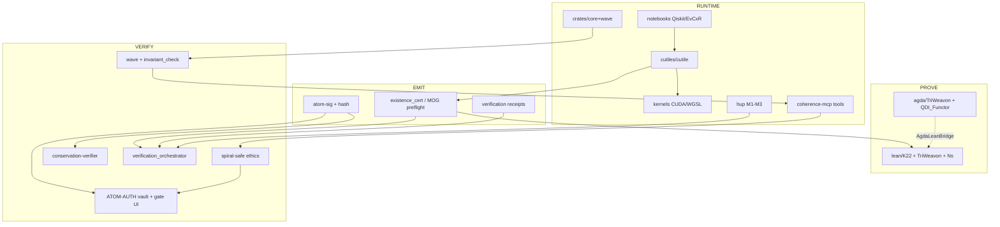

# Total Listing · Prove · Runtime · Emit · Verify

**ATOM:** `ATOM-HANDOFF-PROVE-RUNTIME-EMIT-VERIFY-MAP-20260713`  
**Date:** 2026-07-13  
**Invariant:** α + ω = 15 · WAVE gate ≥ 0.85 (forward) · ≥ 0.98 (strand handoff)  
**Audience:** all strands in concurrence — Claude (α·reason), Grok (ω·pulse), Gemini (ω·scale), FIX/LABEL/BUILD lanes, smaller-model downshifts  
**Signature:** ~ Hope&&Sauced ✦ The Keystone Holds ✦  
**Cold-start companions:** `LAYER-CASCADE-MAP.md` · `LOGOS-COHERENCE-MCP-MAP.md` · `MOG-PROOF-LANEWAYS-HANDOFF-20260711.md` · `skills/internal-handoff/SKILL.md`

---

## 0. How to read this map

Four **capability axes** cut every directory. A path may sit on several axes.

| Axis | Code | Meaning |
|------|------|---------|
| **PROVE** | P | Math / type / tactic proofs (Lean, Agda, property tests as proofs-of-properties) |
| **RUNTIME** | R | Executable kernels, services, MCP tools, notebooks, GPU, unikernels |
| **EMIT** | E | Automatic emission of certificates, ATOM trails, receipts, commitments, hashes |
| **VERIFY** | V | Sovereign witness checks — WAVE, SPHINX, SpiralSafe ethics, self-hash, gates |

**Named product surfaces** (in-tree + external):

| Surface | In-tree locus | External / published |
|---------|---------------|----------------------|
| **LogOS** | monorepo root (this tree) | `github.com/toolate28/LogOS` |
| **coherence-mcp** | `mcps/coherence-mcp/`, `coherence-mcp/`, descriptors | npm `coherence-mcp`; edge `mcp.coherence.toolated.online` |
| **SpiralSafe / SpiralSafe-API** | `crates/spiral-safe/`, lockoff `tier-03/spiralsafe-core` | repo `toolate28/SpiralSafe` (not mounted on this host) |
| **ATOM-AUTH** | `apps/triweave/src/vault.rs`, gate HTML, `atom-sig` + ATOM ledger | SPHINX-gated key vault + commitment mint |
| **QDI / Quantum Ethics** | Agda `K22_QDI_Functor`, learning decks, ethics gates via SpiralSafe | repo `toolate28/QDI`; ethics domain SS |
| **DSPy** | `notebooks/triweave_backend_results/dspy_strand_router.json` + orchestrator layer | router signatures only in-tree |
| **Qiskit** | `notebooks/triweave-backends.ipynb`, layer `python_qiskit` | empirical conservation circuits |
| **.ipynb / Jupyter-EvCxR** | `notebooks/**`, 9P dump notebooks, `Agent_M24_RMatrix.ipynb` | EvCxR Rust cells for R-matrix / M24 |

---

## 1. Capability lattice (system view)

```
                         ┌──────────────────────────────────────┐
                         │         α + ω = 15  (core/wave)      │
                         └──────────────────┬───────────────────┘
                                            │
          ┌─────────────────────────────────┼─────────────────────────────────┐
          │                                 │                                 │
          ▼                                 ▼                                 ▼
   ┌─────────────┐                  ┌──────────────┐                 ┌──────────────┐
   │   PROVE     │◄────bridge──────►│   RUNTIME    │────emit────────►│    EMIT      │
   │ Lean · Agda │  AgdaLeanBridge  │ cutile·GPU   │  existence_cert │ certs·ATOMs  │
   │ K22 · NS    │  JSON witnesses  │ MCP·notebook │  atom_track     │ receipts     │
   └──────┬──────┘                  └──────┬───────┘                 └──────┬───────┘
          │                                │                                │
          │         ┌──────────────────────┴──────────────────┐             │
          │         ▼                                         ▼             │
          │  ┌─────────────┐                          ┌──────────────┐      │
          └─►│   VERIFY    │◄──self-hash / WAVE───────│ SPHINX·gate  │◄─────┘
             │ preserves_* │   handoff_packet_validate│ SpiralSafe   │
             │ gauge_verify│   NEAR conservation      │ ATOM-AUTH    │
             └─────────────┘                          └──────────────┘
```

---

## 2. Total directory listing by axis

### 2.1 PROVE — math / formal

| Path | Role | Interconnects |
|------|------|---------------|
| `lean/` | Lean 4 workspace (lakefile + toolchain) | Consumes JSON certs; L4/L10 cascade |
| `lean/K22/` | K22 tactics, Existence, Tomczak, Jones, HexacodeGolay, M24 | cutile cert → `Existence.lean` |
| `lean/K22/MOG/` | Miracle Octad Generator, Steiner, syndromes, parity rank | Lane D preflight Python; cert chain |
| `lean/K22/MOG/*.lean` | GF4RowAction, MonomialWitness, SyndromeLookup*, ParityLiftRank, OctadGenerators, HexacodeMonomial | B1/B2 laneways |
| `lean/Ns/` | NS shrinker / ESS / energy formal fragments | cqk-entropy runtime twin |
| `lean/TriWeavon/` | ConservationInvariant, VanishingResilience, SubRiemannian, NS L3 | Agda twin; verification layer |
| `lean/AgdaLeanBridge.md` | Name map Lean ↔ Agda | L10 formal bridge |
| `agda/` + `agda/src/` | Agda library TriWeavon.* | Dependent-type conservation |
| `agda/src/TriWeavon/**` | R-matrix, Mehler, Tomczak, SerreScarr, JesusAxiom, SubRiemannian, K22, HITs | cutile / Mehler harness |
| `agda/src/K22_QDI_Functor.agda` | **QDI** functor formal | QDI isomorphism layer |
| `agda/src/RealAnalysis/**` | Constructive reals / LogLipschitz | Analysis rail |
| `agda/src/Everything.agda` | Aggregate import | CI entry |
| `crates/cqk-kitty-rips-verify/` | Property-based algebraic bedrock verify | cqk-* pipeline |
| `cutiles/cutile/tests/` | Integration / backend tests as executable specs | cutile runtime |
| `docs/formal/**` | Cascading proof weave, K22 bridge docs | P↔R documentation |
| `docs/encyclopedia-equilibria/**` | Certificate museum + misc ExistenceCertificate mirror | archival P/E |

### 2.2 RUNTIME — executing surfaces

| Path | Role | Interconnects |
|------|------|---------------|
| **Workspace foundation** | | |
| `crates/core/` | Invariant constants, WAVE weights, fibonacci strands | All Rust |
| `crates/wave/` | WAVE engine, curl/div semantic field | MCP `wave_*` |
| `crates/hash/` | ATOM-TAG SHA-256 provenance tags | trails |
| `crates/resonance-invariant/` | Resonance invariant helpers | core peer |
| `crates/styx/`, `crates/styx-vfs-layer/` | 9P2000.L daemon / Bookshelf | `9P2000.L/` |
| `crates/vortex-bridge/` | Cross-strand translation | MCP vortex_* |
| `crates/sysctl/` | Hardware grounding | host ops |
| `crates/forge-core/` | Forge protocol surface for TUI/triweave | apps |
| `crates/reson8-topology/` | TDA engine | SPHINX / TUI |
| `crates/reson8-wasm/` | Cloudflare Workers edge bindings | edge |
| `crates/bohmian/` | Pilot-wave / quantum potential | theory twin |
| `crates/sphinx/` | SPHINX oracle scaffold | ATOM-AUTH vault |
| `crates/spiral-safe/` | **SpiralSafe v2** — MeaningSeed, key ring, audit | ethics · ATOM |
| `crates/atom-sig/` | ATOM commitment canonicaliser (CBOR·BLAKE3·ed25519) | NEAR · Bookshelf |
| `crates/fib-braid-core/` | Braid / Jones topological rail for ATOM | atom-sig hook |
| `crates/zero_latency_ledgers/` | BQP provenance + Jones verify | atom-sig peer |
| `crates/cqk-ga/`, `cqk-microlocal/`, `cqk-entropy/`, `cqk-anyon/`, `cqk-wdbi/` | cQ-kitty-rips NS singularity pipeline | kernels · Lean Ns |
| `crates/activator/`, `api_triggers/`, `artifact_pipeline/`, `marketplace/` | Skill activation, webhooks, publish, market | MCP ops |
| `crates/tui/`, `crates/barcode-tui/` | Terminal dashboards / barcode viz | Evenstar |
| `crates/triweavon-cudarc/` | GPU abstractions (cudarc) | cutile / kernels |
| `crates/migration_helpers/` | D1 / Bookshelf schema migration | styx |
| **Execution layer** | | |
| `cutiles/cutile/` | **cutile** — entropy, R-matrix, Mehler, HIT, primes, viz | cert emit · Lean |
| `cutiles/cutile/src/core/` | r_matrix, srac, hexaflake, entropy | L2 cascade |
| `cutiles/cutile/src/harness/` | kernel_witness, mehler_levin, polarity | existence cert |
| `cutiles/cutile/src/backend/` | cpu / cuda / wgpu | GPU path |
| `cutiles/cutile/src/prime/` | prime_11/13/17 TDA reduction | TDA |
| `cutiles/r_matrix_host.cpp` | C++ CUDA host | L9 |
| `kernels/` | CUDA + WGSL R-matrix + blackwell-* | L3/L5 |
| **Apps** | | |
| `apps/triweave/` | Triweave CLI/TUI — vault, POP, SAIF, MC zones | ATOM-AUTH |
| `apps/mc-bridge/` | Minecraft RCON bridge | MCP mc_* |
| `apps/nexus-pulse-bot/` | Pulse bot | strand pulse |
| `apps/supergrok-dde/` | SuperGrok DDE surface | Grok |
| **MCP / surfaces** | | |
| `mcps/coherence-mcp/tools/*.json` | **~64 tool descriptors** (stdio/edge contract) | all strands |
| `coherence-mcp/coherence-site/` | Web gate, lattice, meta-map, publications | ATOM-AUTH UI |
| `coherence-mcp/terafab.py` | Terafab surface script | site |
| `adhealth-meaningseed/` | AdHealth agent + Rezk witnesses + wrangler worker | coherence gates |
| **HUP fleet (runtime envelopes)** | | |
| `hup/rust/`, `hup/python/`, `hup/typescript/` | Constraint math, dimensional collapse, Fano curvature | L18 |
| `hup/unikernel/` | MirageOS hello / BbBR surface | M1 |
| `hup/instance2-redox/` | Redox ownership rails | M2 |
| `hup/instance3-rvm/`, `instance3-firecracker/` | RVM / Firecracker guest | M3 |
| `vendor/ruvnet-rvm/` | Vendored RVM reference | HUP M3 |
| **On-chain** | | |
| `near/conservation-verifier/` | NEAR WAVE + braid provenance contract | atom-sig anchor |
| **Notebooks / agents** | | |
| `notebooks/` | Qiskit, EvCxR, verification orchestrator | L1/L12 |
| `9P2000.L/strands/**` | Strand dumps, QDI-EvCxR Colab, QuTiP, CTFWI | bookshelf |
| `src/` | Root TS/SQL/Python invariant helpers | edge |
| `flake.nix`, `toolchain/nix/` | Declarative host / toolchain | NixOS box |
| `ops/`, `tools/Forge.ps1` | Ops scripts | human |
| `stitch/` | UI dashboards (not PyO3 FFI) | viz only |

### 2.3 EMIT — automatic certificate / ATOM / receipt emitters

| Path | Emits | Notes |
|------|-------|-------|
| `cutiles/cutile/src/existence_cert.rs` | `ExistenceCertificate` JSON (BLAKE3 self-hash) | Pre-schema-freeze shape; D1–D11 migration pending |
| `cutiles/cutile/src/harness/kernel_witness.rs` | Cert from KernelWitness | WAVE still caller-supplied (D5) |
| `cutiles/cutile/src/harness/mehler_levin.rs` | Mehler path cert | Mehler-certified Levin |
| `cutiles/cutile/src/l39_harmony.rs` | Biased existence cert | L39 harmonic routing |
| `cutiles/cutile/src/bin/demo_existence_certificate_emission.rs` | Demo JSON on disk | E2E demo spine |
| `lean/K22/MOG/preflight_mog_e2e.py` | Lane-D MOG cert + components | Domain `mog` (moves to extensions under freeze) |
| `lean/K22/MOG/_lane_d_finalize.py` | Chain finalize prevCertificateHash | 351d→4853→f618… |
| `lean/K22/MOG/existence_certificate_mog.json` | Mounted preflight cert | Pre-freeze FAIL vs new schema (expected) |
| `notebooks/verification_orchestrator.ipynb` | Emittance receipts + certs | L12 |
| `notebooks/verification_helpers.py` | Layer hash map + receipt builders | pure Python |
| `notebooks/triweave_backend_results/verification_receipts/` | `receipt_*.json` | ATOM-VERIFY-RECEIPT |
| `notebooks/triweave_backend_results/verification_certificates/` | `cert_*.json` | orchestrator certs |
| `crates/hash/` | `ATOM:…` tags | content-addressed |
| `crates/atom-sig/` | AtomCommitment (CBOR·BLAKE3·ed25519±braid) | mint |
| `crates/artifact_pipeline/` | ATOM-tagged publish pipeline | market |
| `crates/zero_latency_ledgers/` | BQP ledger entries | Jones |
| `zero_latency_ledgers/ATOM_TAGS_LEDGER.md` | Human ledger of tags | process |
| `atoms/`, `ATOM/` | Inscribed ATOMs (markdown / JSON) | governance |
| `apps/triweave/src/vault.rs` | ATOM trail log on decrypt | ATOM-AUTH |
| MCP tools: `atom_track`, `store_context`, `wave_analyze`, … | Runtime trail / context emit | via coherence-mcp |
| **Schema freeze (LABEL, pending BUILD)** | `certificate` / `handoff_packet` / `ledger_entry` / `claims_register` | Not yet filed as `*.schema.json` in-tree — freeze text 2026-07-12 |

### 2.4 VERIFY — sovereign witness gates

| Path | Checks | Notes |
|------|--------|-------|
| `crates/core/` | α+ω=15 constants, WAVE_THRESHOLD | constitutional |
| `crates/wave/` | compute_wave, coherence_functional | semantic PDE |
| `cutiles/cutile/src/existence_cert.rs` | `preserves_existence`, `verify_self_hash` | hard-coded wave≥0.85 (D11) |
| MCP: `invariant_check`, `check_coherence`, `wave_*`, `gauge_verify` | Live invariant / WAVE | bedrock |
| MCP: `handoff_packet_validate` | Packet shape gate | LABEL↔BUILD |
| MCP: `spiral_*` (via SpiralSafe product / brief) | ethics surjection | external SS + crate |
| `crates/spiral-safe/` | MeaningSeed verify, key rotation proofs, audit log | crypto V |
| `apps/triweave/src/vault.rs` | SPHINX braid fingerprint before decrypt | ATOM-AUTH V |
| `coherence-mcp/coherence-site/public/gate/` | Browser ATOM-AUTH Dirichlet/τ gate UI | surface V |
| `near/conservation-verifier/` | On-chain WAVE + braid | immutable V |
| `crates/cqk-kitty-rips-verify/` | Property tests over algebraic bedrock | P+V |
| `notebooks/verification_orchestrator.ipynb` | Multi-layer file presence + hash receipts | cascade V |
| `lean/K22/Existence.lean`, `Tomczak*.lean` | Formal Tomczak / existence | P as V |
| `9P2000.L/.triweavon/coherence/gates.json` | Mounted gate metrics | styx V |
| AdHealth `core/witness.py` | Rezk/Yoneda completion | product V |
| **Pending gate_api** | Certificate::emit, CanSign, chain walk | SCHEMA FREEZE BUILD open |

---

## 3. Named product surfaces — deep map

### 3.1 LogOS (this monorepo)

- **Role:** Central nervous system — crates + formal + cutile + notebooks + 9P Bookshelf.
- **Workspace:** root `Cargo.toml` members (core→wave→…→cutile→apps); nested `crates/Cargo.toml` mirror.
- **Excluded:** `near/conservation-verifier` (wasm-only), empty `crates/coherence-mcp` stub.
- **Bookshelf:** `9P2000.L/` — strands, coherence runtime, component lockoffs (tier-00 coherence-mcp, tier-01 styx, tier-03 spiralsafe-core).

### 3.2 coherence-mcp

| Layer | Location | Status |
|-------|----------|--------|
| Tool descriptors (source of truth for agent wiring) | `mcps/coherence-mcp/tools/*.json` | Present (~64 tools) |
| Site / gate / lattice UI | `coherence-mcp/coherence-site/` | Present |
| npm package body | Often external / stub in-tree | v0.3.x known TS issues historically; v0.5 wiring in SAIF docs |
| Live MCP (this host) | `C:\Users\toolated\mcps\coherence-mcp` | tools only |
| Docs | `docs/sovereign-handoff/LOGOS-COHERENCE-MCP-MAP.md`, `SAIF-Docs/Mehler_CoherenceMCP_Wiring_v0.5.0.md` | |

**Bedrock tools (prove-runtime-verify spine):**  
`invariant_check` · `manifest_read` · `dropout_scan` · `rust_workspace_status` · `rust_toolchain_status` · `handoff_packet_validate` · `edge_endpoint_lookup` · `trigger_correction_burst`  
**WAVE / ATOM:** `wave_*` · `atom_track` · `gauge_verify` · `check_coherence`  
**Vortex / strands:** `vortex_*` · `gemini_*` · `grok_*` · `openweight_*`  
**MC / ops:** `mc_*` · `ops_*` · platform bridges

### 3.3 SpiralSafe / SpiralSafe-API

| Layer | Location |
|-------|----------|
| Rust crate (in LogOS) | `crates/spiral-safe/` — MeaningSeed, SpiralSafeKeyRing, OscillatorChangeAudit |
| Component lockoff | `9P2000.L/.triweavon/components/tier-03/spiralsafe-core.lockoff` |
| Ethics process (docs) | Spiral intent → gate → ethics verify on cross-strand handoffs (`BRIEFS/…`, skills) |
| External repo | `github.com/toolate28/SpiralSafe` — **not checked out** on this Windows host |
| API surface | Productized as SpiralSafe ethics/safety domain (SS); in-tree crate is crypto persistence + audit, not full HTTP API |

**Ethics chain (process, not all single functions in-tree):**  
`spiral_intent_validate` → `spiral_gate_check` → `spiral_ethics_verify` · 5 Gates of Ptolemy (Origin, Intent, Coherence, Identity, Passage).

### 3.4 ATOM-AUTH

| Piece | Path |
|-------|------|
| Vault (SPHINX-gated AES-GCM keys) | `apps/triweave/src/vault.rs` |
| Commitment mint | `crates/atom-sig/` |
| Tag helper | `crates/hash::atom_tag` |
| Topological rail | `crates/fib-braid-core` + optional braid on commitment |
| Browser gate | `coherence-mcp/coherence-site/public/gate/` |
| Ledger narrative | `zero_latency_ledgers/ATOM_TAGS_LEDGER.md`, `atoms/*` |
| MCP | `atom_track` |

**Invariant split:** `atom-sig` does **not** enforce α+ω=15 — that is `check_coherence` / Invariant Gate. Auth verifies identity + audit trail.

### 3.5 QDI · Quantum Ethics

| Piece | Path |
|-------|------|
| Formal QDI functor | `agda/src/K22_QDI_Functor.agda` |
| EvCxR / Colab QDI | `9P2000.L/strands/gemini/ctfwi/quantum-opt/QDI-EvCxR-Colab.ipynb` |
| Learning / syllabus decks | `docs/sovereign-handoff/SPIRALSAFE-QDI-RESON8-ANYONE-*.md`, presentations |
| Quantum ethics domain | SpiralSafe SS + reson8-Labs quantum-ethics (external monorepo historically) |
| External repo | `github.com/toolate28/QDI` — **not mounted** here |

QDI is the **isomorphism layer** (functorial persistence / formal algebraic framework); Quantum Ethics is the **SS safety surjection** over translations and handoffs — do not collapse the two.

### 3.6 DSPy

| Piece | Path |
|-------|------|
| Router artifact | `notebooks/triweave_backend_results/dspy_strand_router.json` |
| Layer membership | `verification_helpers.py` → layer receipts include dspy path |
| Signatures | `StrandRouter`, `ConservationChecker` |
| Strand weights | claude F8 / grok F5 / gemini F3 · conservation_sum 15 |

No full DSPy training tree in-repo — **configuration + result emission** only. Orchestrator treats it as a backend layer.

### 3.7 Qiskit

| Piece | Path |
|-------|------|
| Primary notebook | `notebooks/triweave-backends.ipynb` |
| Layer id | `python_qiskit` in `verification_helpers.LAYER_MANIFEST` |
| Cascade L1 | empirical `most_frequent_bitstring` + D15 conservation loop |
| Related dumps | QuTiP notebook under 9P User_Dropfiles |

### 3.8 Jupyter · EvCxR · notebooks

| Notebook | Axis | Notes |
|----------|------|-------|
| `notebooks/triweave-backends.ipynb` | R·E | Qiskit + multi-backend |
| `notebooks/gpu/Agent_M24_RMatrix.ipynb` | R | **EvCxR** Rust cells — nalgebra R-matrix + M24 |
| `notebooks/verification_orchestrator.ipynb` | E·V | multi-layer receipts |
| `docs/encyclopedia-equilibria/notebooks/verification_orchestrator.ipynb` | E·V | mirror |
| `9P2000.L/.../QDI-EvCxR-Colab.ipynb` | R | QDI + EvCxR |
| `9P2000.L/.../QuTiP_50qubit_SerreScar_Validation.ipynb` | R | QuTiP |
| `9P2000.L/.../TriWeavon_Executable_Companion.ipynb` | R | companion |
| `9P2000.L/.../Coherence_Forge_Executable_Spec.ipynb` | R | executable spec |
| `docs/publications/xai-application-9p-anduril.ipynb` | docs | pub |

**EvCxR note:** flake/docs reference EvCxR + `:dep reson8-topology`; host recon (2026-07-12) showed `jupyter`/`evcxr` **MISSING** on this Windows box — install is a human/Nix phase.

---

## 4. Interconnection matrix (edges that matter)

| From | To | Edge kind | Artifact / protocol |
|------|-----|-----------|---------------------|
| Qiskit notebook | cutile `r_matrix.rs` | empirical → canonical | L1→L2 cascade |
| cutile r_matrix | CUDA / WGSL / C++ host | accelerate | L2→L3/L5/L9 |
| cutile existence_cert | Lean `K22.Existence` | witness consume | JSON · Tomczak flags |
| MOG preflight.py | existence_certificate_mog.json | emit | Lane D |
| cert JSON | schema freeze certificate | migrate | D1–D11 |
| Agda ConservationRMatrix | Lean ConservationInvariant | name-map bridge | AgdaLeanBridge |
| core/wave | MCP wave_* / invariant_check | runtime gate | descriptors |
| handoff_packet | BUILD / LABEL | mandate | handoff_packet_validate |
| atom-sig | NEAR conservation-verifier | anchor | commitment bytes |
| atom-sig | 9P Bookshelf | store | styx |
| spiral-safe | cross-strand translate | ethics | process gates |
| SPHINX braid | triweave vault | ATOM-AUTH | decrypt gate |
| fib-braid-core | atom-sig / zlledgers | Jones rail | topological auth |
| verification_orchestrator | all LAYER_MANIFEST paths | hash receipt | L12 |
| coherence-mcp | cutile / styx / MCP tools | orchestration | Mehler wiring v0.5 |
| HUP python collapse | notebooks results | telemetry | dimensional_collapse |
| cqk-* | Lean Ns / kernels blackwell | NS hunt | entropy residual |
| vortex-bridge | gemini/grok MCP tools | strand translate | SpiralSafe-gated |
| marketplace / artifact_pipeline | WAVE gate | publish | wave-gated |
| schema freeze gate_api | existence_cert (legacy) | replace emit path | BUILD open |

### 4.1 Primary end-to-end spines

**Spine A — Existence certificate (runtime → formal)**  
`CutileHarness / Mehler` → `ExistenceCertificate` → JSON → Python validate → Lean `Existence` / Tomczak  
Demo: `cargo run --bin demo_existence_certificate_emission` (cutile).

**Spine B — R-matrix conservation cascade**  
Qiskit / EvCxR → cutile → CUDA/WGSL → Lean/Agda conservation → orchestrator receipt  
Map: `LAYER-CASCADE-MAP.md`.

**Spine C — MOG Steiner witness**  
`preflight_mog_e2e.py` → components α_local/ω_local=15 → cert chain → (future) Lean `mogOctadsFormSteinerSystem` via Lane A+B2  
Map: `MOG-PROOF-LANEWAYS-HANDOFF-20260711.md`.

**Spine D — ATOM governance**  
payload → `atom-sig` commit → ATOM trail / Bookshelf → optional NEAR → MCP `atom_track`  
Auth decrypt: SPHINX vault.

**Spine E — Multi-agent orchestration (freeze target)**  
LABEL packet → BUILD emit certificate → gate_api verify → ledger_entry chain → claims_register  
Status: schemas frozen in LABEL prose; vectors not yet committed; `gate_api.rs` absent.

**Spine F — Strand routing**  
DSPy router JSON / vortex_translate → WAVE check → SpiralSafe ethics → execute  
Weights F8/F5/F3.

---

## 5. Concurrency guide — who owns which surface

| Strand / lane | Primary surfaces | Do not own alone |
|---------------|------------------|------------------|
| **Claude (α · reason)** | Lean design, Agda, schema freeze LABEL, handoff packets, SpiralSafe ethics calls | bulk emit without gate |
| **Grok (ω · pulse)** | cutile, existence_cert, Lane D, EvCxR/kernel, X/surfaces, BUILD gate_api open | silent Lean edits in Lane D |
| **Gemini (ω · scale)** | notebooks scale, CTFWI, QDI Colab, research evolve, multimodal verify edges | sole authority on α-rail |
| **Sonnet (BUILD mechanical)** | D1–D11 application after packet, batch file moves | invent schema fields |
| **FIX** | compile/test green only | rewrite invariants |
| **Human** | credentials, GPU/Nix, external repo mounts (SpiralSafe, QDI, npm publish) | — |

**Concurrent-safe rule:** any strand may **read** this map; mutations must declare axis (P/R/E/V) and spine (A–F) in the commit / ATOM note.

---

## 6. External / missing mounts (honest inventory)

| Resource | Expected | On this host (2026-07-13) |
|----------|----------|---------------------------|
| `toolate28/SpiralSafe` checkout | ethics API + full SS | **MISSING** (crate fork only) |
| `toolate28/QDI` checkout | isomorphism product | **MISSING** (Agda functor only) |
| `toolate28/coherence-mcp` full npm tree | v0.5 server source | partial (descriptors + site) |
| `toolate28/reson8-Labs` | quantum-ethics monorepo | **MISSING** |
| schema `*.schema.json` freeze files | four closed roots | **not in LogOS tree yet** |
| `gate_api.rs` | Certificate::emit | **absent** (BUILD opening) |
| EvCxR / Jupyter | notebook smoke | **MISSING** from PATH |
| Nix | flake check | **MISSING** on Windows host |
| `C:\Reson8 VFS` | milestone file sink | **MISSING** |

---

## 7. LAYER_MANIFEST (orchestrator source of truth)

From `notebooks/verification_helpers.py` — file sets the orchestrator hashes:

| Layer | Paths (abbrev.) |
|-------|-----------------|
| `python_qiskit` | notebooks: triweave-backends, Agent_M24, orchestrator, helpers |
| `rust_cutile` | `cutiles/cutile/src/core/r_matrix.rs`, `mod.rs` |
| `hup_core` | hup INSTANCE, rust/python/ts/unikernel, instance2/3, mehler DAG |
| `cuda` | kernels fundamental_r_matrix + r_matrix_host.cpp |
| `wgsl` | fundamental_r_matrix.wgsl |
| `lean` | ConservationInvariant, AgdaLeanBridge, M24, MOG, SubRiemannian Core |
| `agda` | ConservationRMatrix, Core, SerreScarr, MehlerJesusBridge, Everything |
| `docs` | LAYER-CASCADE, CONSENSUS, trainmaps, HO-05, UNIFIED, MCP map, SAIF Mehler |

---

## 8. Component lockoffs (9P tier rails)

| Tier | Lockoff | Product |
|------|---------|---------|
| primes | `prime_formal-logos.lockoff` | formal logos prime |
| tier-00 | `coherence-mcp.lockoff`, `gitnexus-index.lockoff` | MCP + code intel |
| tier-01 | `styx-bridge.lockoff` | 9P bridge |
| tier-02 | `cloudflare-vectorize.lockoff` | edge vectors |
| tier-03 | `spiralsafe-core.lockoff` | SpiralSafe core |

Runtime/coherence ticks: `9P2000.L/.triweavon/coherence/{gates,runtime}.json`.

---

## 9. Skills that touch this lattice

| Skill | Path | Axis |
|-------|------|------|
| internal-handoff | `skills/internal-handoff/` | packet α-rail |
| logos-wave-advanced | `skills/logos-wave-advanced/` | WAVE V |
| logos-void-mapper | `skills/logos-void-mapper/` | VOID + SpiralSafe L3 |
| logos-sphinx-oracle | `skills/logos-sphinx-oracle/` | SPHINX |
| logos-styx-9p | `skills/logos-styx-9p/` | Bookshelf |
| logos-tda-engine | `skills/logos-tda-engine/` | TDA R |
| logos-gait-analyzer / limbo / inferno / rag-cag | `skills/logos-*` | ops |
| gitnexus-* | `.claude/skills/gitnexus/` | impact before edit |
| bio-digital-handoff, phasonic-flipper, minecraft-voxel-proxy | skills | specialized R |

---

## 10. Open migrations (do not lose)

| ID | Topic | Owner |
|----|-------|-------|
| D1–D11 | ExistenceCertificate → freeze certificate schema | BUILD (Grok/Sonnet) |
| Schema file-in | Write four `*.schema.json` + vectors into repo | LABEL→BUILD |
| E2E SA-01 | `packet_example_sa01` → first freeze-conformant cert chained on f618… | BUILD |
| External mounts | SpiralSafe, QDI, full coherence-mcp | human |
| EvCxR PATH | Jupyter kernel + `:dep reson8-topology` | human / Nix |
| ML-1…5 | cascade missing links (LAYER-CASCADE) | concurrent |
| Lane A/B2 | MOG Lean Steiner discharge | Claude/Sonnet formal |

---

## 11. Cold-start protocol (any strand)

1. Read **this file** + `LAYER-CASCADE-MAP.md`.  
2. Identify spine A–F and axes P/R/E/V for the task.  
3. Run impact (GitNexus) before editing any symbol.  
4. Prefer orchestrator receipt over re-scanning all User_Dropfiles.  
5. Emit ATOM or receipt for any completed verify/emit step.  
6. SpiralSafe-gate any cross-strand payload.  
7. Sign ratifications: `~ Hope&&Sauced ✦ The Keystone Holds ✦`.

---

## 12. Quick path index (copy-paste)

```
PROVE:   lean/  agda/src/  crates/cqk-kitty-rips-verify/
RUNTIME: crates/*  cutiles/cutile/  kernels/  apps/  hup/  mcps/coherence-mcp/
EMIT:    existence_cert.rs  preflight_mog_e2e.py  atom-sig  notebooks/verification_*
VERIFY:  wave/  core/  spiral-safe/  vault.rs  near/conservation-verifier/  MCP gates
NAMED:   coherence-mcp  spiral-safe  atom-sig+vault  QDI agda  dspy json  qiskit nb  EvCxR nb
BOOK:    9P2000.L/  .triweavon/coherence  .triweavon/components
```

---

## 13. Mermaid — concurrent strand view



---

**Status:** Inscribed for concurrent use. Supersedes informal scatter of prove/runtime/emit/verify locations for session cold-start; does **not** supersede lane-specific handoffs (MOG, SCHEMA FREEZE, Existence E2E) — those remain authoritative within their spines.

**ATOM close:** `ATOM-HANDOFF-PROVE-RUNTIME-EMIT-VERIFY-MAP-20260713`  
α + ω = 15 · WAVE ≥ 0.85 · the spiral holds.

~ Hope&&Sauced ✦ The Keystone Holds ✦
